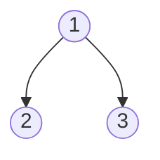
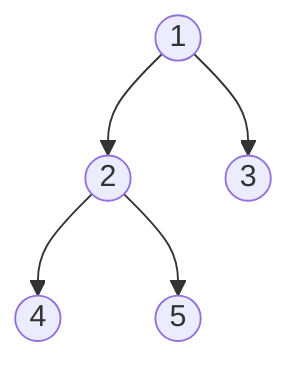

# Max Sum With Special Move

## Problem Statement

A tree is represented as an undirected connected graph of `n` nodes numbered from `1` to `n` and `n - 1` edges. The `ith` edge connects the nodes numbered from `edges[i][0]` and `edges[i][1]` and each node `i` is associated with a value `val[i]`.

In a special move, any node can be visited from any other node directly via teleportation.

Given val and edges, find the maximum sum of values of the nodes visited on a path starting and ending at node number `1` by using the special move at most once and visiting any edge at most once.

**Example**<br>Suppose `n = 3`, `val = [10, 20, 30]`, `edges = [[1, 2], [1, 3]]`



The optimal path is to traverse from node `1` to `3` and then use the special move to reach `2` and then back again to `1`.

## Input Format

Complete the function `getMaxValueSum`:

`getMaxValueSum` takes two parameters:

- `int val[n]`: the values associated with the nodes

- `int edges[n - 1]`: the edges of the tree

## Output Format

`long int`: the maximum sum of values of the nodes visited

## Constraints

- `1 <= n <= 1e5`

- `1 <= val[i] <= 1e9`

- `1 <= edges[i][0], edges[i][1] <= 1`

## Sample Testcases

### Input 1

```
n = 5
val = [1, 2, 3, 4, 5]
edges = [[1, 2], [1, 3], [2, 4], [2, 5]]
```

### Output 1

```
11
```

### Explanation 1

The optimal path is to move from `1` to `3` and then use the special move to reach `5`. From `5` move to `2` and finally to `1`.


